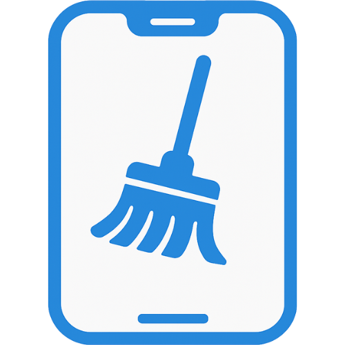

<br />

<div align="center">
        

<h2>FB Mobile - Clean my feeds (Browser Extension)</h2>

[][chromewebstore]

[][addonsmozillaorg]

</div>


<br />

<details>
<summary>Table of contents</summary>


- [How to build](#how-to-build)
  - [Prerequisites](#prerequisites)
  - [Install dependencies](#install-dependencies)
  - [Start development server](#start-development-server)
  - [Create a production build](#create-a-production-build)
  - [Create a production zip](#create-a-production-zip)
- [Desclaimer](#desclaimer)
- [License](#license)


</details>

Hides unwanted posts from **Facebook feed on mobile**. Get a clean Newsfeed with posts only from friends, pages and groups you follow.


This extension is a continuation and improvement of the [FB Mobile – Clean my feeds](https://github.com/webdevsk/FB-Mobile-Clean-my-feeds) userscript on [GreasyFork](https://greasyfork.org/en/scripts/479868-fb-mobile-clean-my-feeds), but without the bloat, installation hassle, or compatibility issues of userscript managers. It does the same job, with added benefits on top.

An added benefit of converting it into an extension is that the website can now be installed as a standalone PWA app, giving you a smoother, app-like experience.

### Features
- 🚫 Sponsored posts – remove annoying ads
- 📌 Suggested posts – hide algorithm-recommended content
- 🎥 Reels – block distracting short videos
- 👥 People You May Know – remove friend suggestions
- 📄 Suggested pages (join/follow) – hide irrelevant recommendations
- ⚙️ Customizable filters – choose what to hide from the Settings page (gear icon in the top right)
- 📲 Installable app (Extension exclusive) – install the website as an app by adding it to the home screen

<br />

### How to use

1. Install a browser that supports Extensions, such as `Quetta Browser` on [Android](https://play.google.com/store/apps/details?id=net.quetta.browser) or [IOS](https://apps.apple.com/us/app/quetta-ad-free-video-browser/id6504077999), Mises, Lemur or any Firefox based browsers. Kiwi Browser is not recommended as it's abandoned and out of date.
1. Launch your preferred browser then head to Chrome Web Store and search for "FB Mobile - Clean my feeds". Alternatively, you can follow this link: [https://chromewebstore.google.com/detail/fb-mobile-clean-my-feeds/oipbhmdodiafhpfglkeomlldnbahdlfd][chromewebstore]
1. **(Optional)** Install [uBlock Origin](https://chromewebstore.google.com/detail/ublock-origin/cjpalhdlnbpafiamejdnhcphjbkeiagm) extension.
   - Not required for this extension but will improve your overall browsing experience by a mile.installation: [GreasyFork](https://greasyfork.org/en/scripts/479868-fb-mobile-clean-my-feeds)
1. Browse https://m.facebook.com/ without all the trash.

#### Install it as a web app (Recommended)

1. Open https://m.facebook.com/
1. Tap on your browser's `3 dot menu`
1. Tap on `Add to Homescreen`

#### Browser/Extension Alternatives
Please refer to this link to find other alternatives if my suggested combination doesn't work for you: https://github.com/KudoAI/googlegpt#-compatibility


### Changelog
- **v1.03**
  - Converted to browser extension
  - PWA implementation
  - Settings overlay can now be closed by tapping on empty area
  - Improved Style injection logic
  - Disabled running on "Videos/Watch" page as it has been overhauled.
  - Fixed Post comment box height issue as a bonus.
- You can refer to the past logs from here: [FB Mobile - Clean my feeds (Userscript)](https://github.com/webdevsk/FB-Mobile-Clean-my-feeds)

### Known issues
Facebook has an enhanced Mobile version of facebook which only works on Chromium browsers. The browsing experience is not as good as the App you are used to. It shows low quality photos and videos. But this is all we got that we can inject a script into.

**ℹ️ So keep the original App installed and use it only for leisure browsing.**

**Other issues**

- **Jitters on prolonged scrolling**
  - Facebook keeps removing seen posts at a random and adjusts filler height accordingly. I still haven't found a good way to tackle this. Pull requests are welcome.
- **Api rate limit** **⚠️Please scroll slowly**
  - After a while they keep pushing hundreds of Suggested posts in a row. As you keep scrolling faster than usual, it is possible to hit Api rate limit.
    `Or in general term: they put a timer between each post requests and you asked for posts before the timer ended`
<br />

⭐ If you like this project a Star would be nice.

⭐ You can request for new filters or submit issues here: [Github/issues](https://github.com/webdevsk/fb-mobile-clean-my-feeds-ext/issues)

⭐ Want to contribute? Refer to the [Contribution][Contribution] page.

⭐ Buy me a coffee

- [](https://github.com/webdevsk/webdevsk?tab=readme-ov-file#buy-me-a-coffee)

## How to build

### Prerequisites

- Node.js 22+ or Bun 1.2+

### Install dependencies

```bash
bun install
```

### Start development server

- Chrome
```bash
bun dev
```

- Firefox
```bash
bun dev:firefox
```

This will:

1. Start the development server
1. Watch for file changes and automatically reload the extension
1. Open your browser with the extension loaded in development mode
  - If you don't want this automatic behavior, create this file at the root directory
  ```js
  # web-ext.config.ts
  import { defineWebExtConfig } from "wxt"
  export default defineWebExtConfig({
    disabled: true,
  })
  ```

### Create a production build

Chrome

```bash
bun run build
```

Firefox

```bash
bun run build:firefox
```
### Create a production zip

Chrome

```bash
bun run zip
```

Firefox

```bash
bun run zip:firefox
```

This will create a production-ready build in the `.output/` directory.


## Desclaimer
- This project is not affiliated with, sponsored by, or endorsed by Facebook, Meta, or any related entity. It is an independent tool created solely to improve user experience.

- Facebook™ is a trademark of Meta Platforms, Inc. This extension is an independent project and uses the Facebook site only to provide filtering functionality.

## License

[MIT](LICENSE)

[Contribution]:CONTRIBUTION.md
[chromewebstore]: https://chromewebstore.google.com/detail/fb-mobile-clean-my-feeds/oipbhmdodiafhpfglkeomlldnbahdlfd
[addonsmozillaorg]: https://addons.mozilla.org/en-US/firefox/addon/fb-mobile-clean-my-feeds/